# Media & Cognition Final Project

> This project is made for 2022-2023 autumn semester.
>
> Teacher: Fang Lu
>
> Team: Liu Guohong, Zuo Tianwei, Peng Qinhe, Zhao Han

## Part 0 - Prerequisites

You can get the models needed through this link: [gm_stereo.pth](https://cloud.tsinghua.edu.cn/smart-link/0c09cee3-2097-4c22-9158-0d522ed64a8f/)(29.5M) and [yolov5x.pt](https://cloud.tsinghua.edu.cn/smart-link/25df38b7-ebd6-42f9-a2be-ef65d9269f7d/)(174.1M), the latter can be automatically downloaded when the code is running. All the code has been tested on Python 3.9.12.

Some packages you might need to install first:

* **rich** (for better appearance of progress bar in stereo video generating)
* **pyyaml** (for extracting information from yaml files in yolo)
* **torch**, **numpy**, **cv2** (basic packages)
* **pathlib** (default installed after Python 3.6)

## Part I - Stereo Camera

### Task 1.1 Build Camera Pair & Stereo Camera Callibration

For **camera pair building**, `@Zuo` had designed the basic frame structure on PC, and we successfully get it printed out in the lab. Proved by the work afterwards, there isn't any problem with the frame and the structure.

The baseline of the camera pairs is about **6 cm**, and here is the photo of it below:

    

---

For **stereo camera callibration**, `@Peng` had got the intrinsic and extrinsic matrix with MATLAB Stereo Camera Callibration Toolbox; and for opencv usage, `@Liu` had written some code to change the matrix into what opencv needed, which is saved in the `./data/camera.yml` file.

The matrix K1,D1,K2,D2,R,T,E,F,R1,R2,P1,P2,Q had been saved in the file. To extract specific matrix from `./data/camera.yml`, there is a function `load_stereo_coefficients(path)` taking care of this, located in `utils`, and you can easily find it there.

---

### Task 1.2 Stereo Disparity(Depth) Estimation

For **stereo disparity estimation**, `@Liu` had referred to the work conducted by  `Haofei Xu,etc` in 2022, which is called "**Unifying Flow, Stereo and Depth Estimation**", with one network structure named "unimatch". This is "a unified dense correspondence matching formulation and model for 3 tasks", which include optical flow, disparity and depth estimation. The link to this work is [here](https://arxiv.org/abs/2211.05783 "arxiv"), and the project page is [here](https://haofeixu.github.io/unimatch/ "unimatch").

    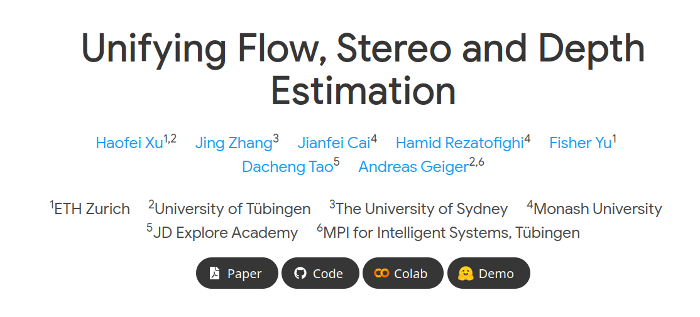

In this project, we have modified the code from that of unimatch, which supports better for opencv frames input. `@Liu` also prepared demo for both image-pair input and video-pair input, since it will be convenient to check the calculation speed for a single frame. (It is disappointing that opencv's `VideoWriter` has a slow speed to write one frame into a video, which is actually about 8~10 times slower than just getting the disparity alone)

You are able to check the demo result of image pairs and video pairs in the `_result` folder. And you can get the same result if you run the code, this time in the `output` folder, and the results are certainly the same. The speed for a single frame or image is about 0.2~0.25 second, the data is got using an GPU (1 TITAN Xp). For video process you will see a much lower result because of low IO speed mentioned above.

<table>
    <tr align="center">
        <td>left image</td>
        <td>right image</td>
        <td>disparity image</td>
    </tr>
    <tr align="center">
        <td>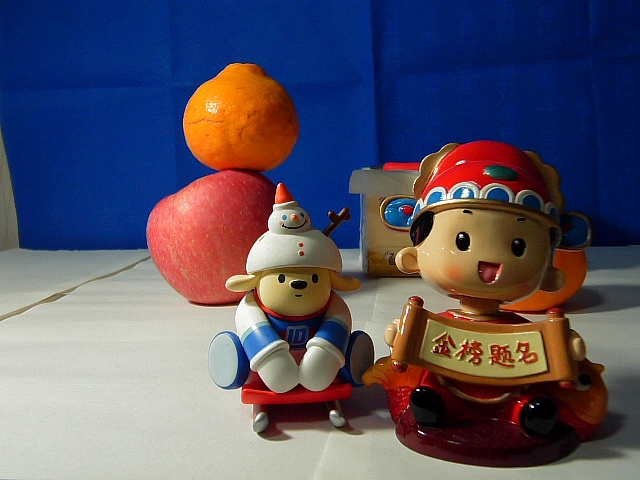</td>
        <td>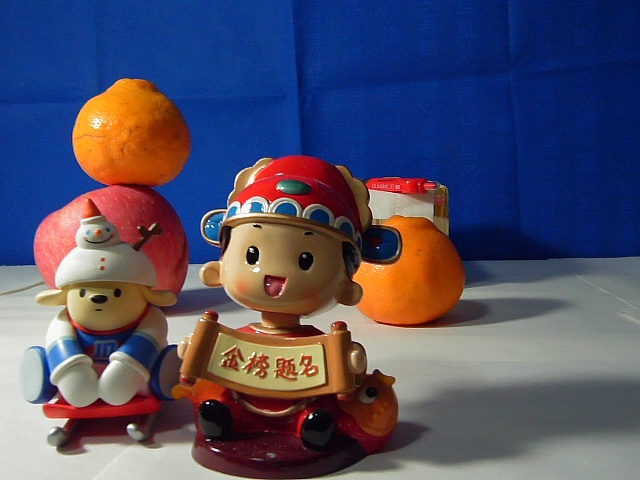</td>
        <td>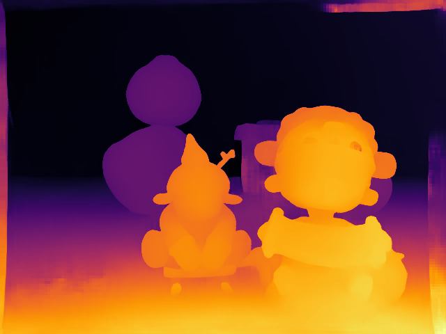</td>
    </tr>
</table>

As the result above, the **modified model** works fine on the self-captured images. You can tell thin textures and clear boundary of objects, with distinct colors. In the video demo, I was **changing the position** of some object and **adding one small object**. Obviously, the result is smooth and fine.

- For image pairs, run (or configure first, not necessary) `stereo_image.py`;
- For video pairs, run `stereo_video.py`;
- If you are interested in testing your own image/video pair, just put them in `data/demo/stereo/images/left` and `xxx/right` folders; remember to rename your images like `left_<whatever you like>.jpg` and `right_<the same as its left pair>.jpg`. For video pairs of your own, remember to specify both paths in the `.py` file.
- To test on your own pairs, **you should change `./data/camera.yml` first**.

---

## Part II - Object Detection

### Task 2.1 Basic Algorithms of Object Detection

#### Algorithm 1. Yolo v5

For **single-stage** object detection algorithm, `@Zuo` had referred to "**YOLOv5 v7.0 by ultralytics**" project, and the Github homepage is [here](https://github.com/ultralytics/yolov5 "yolov5").

Also, we have modified the code to better fit the project of our own. Similar to the file structure in Part I, the **demo input** for the algorithm is under the `data/demo/detection/yolov5/input` folder. You can preview the results in `data/demo/detection/yolov5/_result`.

To get such results from **a code run**, just run `detect_yolo.py` in the root directory. The default model used by us is a COCO-128-class one, whose detailed information can be accessed in `data/coco128.yaml`. The part of the results are showed below.

<table>
    <tr align="center">
        <td>original image</td>
        <td>detected image</td>
    </tr>
    <tr align="center">
        <td>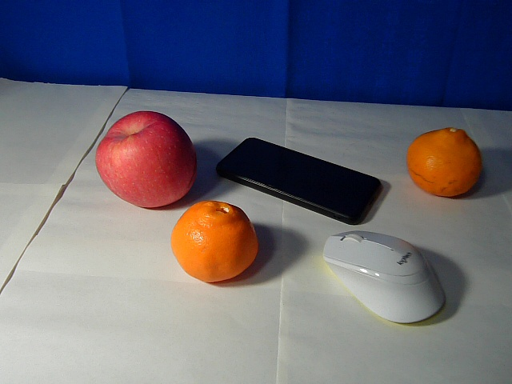</td>
        <td>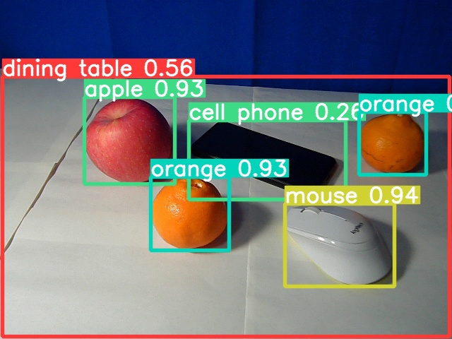</td>
    </tr>
    <tr align="center">
        <td>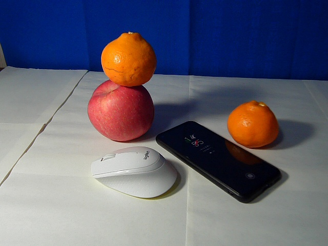</td>
        <td>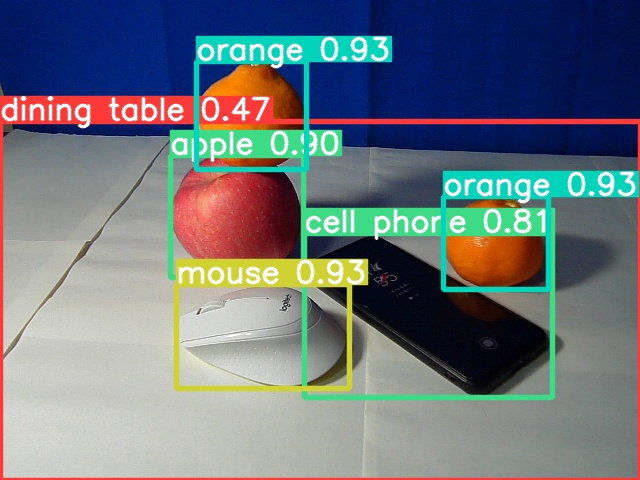</td>
    </tr>
</table>

It can be seen that the algorithm has done a good job, for it does not predict anything wrong, and for it has pointed out all the object in the pictures **captured by our camera**. For the speed of the algorithm, the result can be got in **about 15~20 ms** per image.

#### Algorithm 2. Cascade R-CNN

For two-stage object detection algorithm, `@Zhao` and `@Peng`

### Task 2.2 Object Detection with Depth

For depth embedding in Object Detection algorithms, `@Liu` have designed a simple but useful method to distinguish objects from a photograph with real objects, like the situation below: (You can find the right one in `data/demo/detection/yolov5/_result_depth` folder)

<table>
    <tr align="center">
        <td>pure detection result</td>
        <td>detection with depth embedding</td>
    </tr>
    <tr align="center">
        <td>
            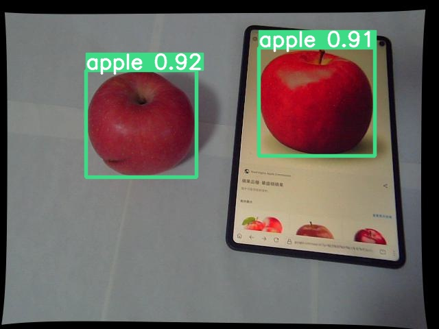
        </td>
        <td>
            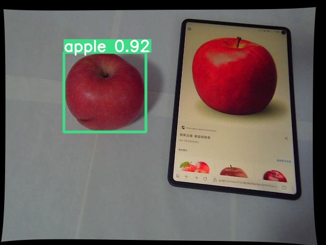
        </td>
    </tr>
</table>

The main idea of the method is simple, which is using the depth information to eliminate those whose depth characteristics is different from the expected object we want to detect. Since we **do not have one RGBD dataset** taken by our own stereo camera, it is hard for us to use a existing deep learning method to realize the target in a complex situation.

As a result, the prior knowledge of the depth of the object we want to detect is very important for the mothod to work well. In order to test it efficiently, we choose to make it work on images and real objects. As a common prior knowledge, real objects' detection result would have a sharp decrease where foreground and background meet, but for a photo it is impossible. Based on this idea, we try to extract the gradient of the depth image using **Sober** filter.

Here is the **gradient** of both detection bboxes, and it can be seen that there are obvious difference between them. To better check the **gradient distribution**, another plot has been taken to show the range of gradients in both bboxes. Obviously, the first image does not have a gradient **larger than 5**, while the second has a max value of **almost 250**, on which we can distinguish them.

<table align="middle">
    <tr>
        <td>gradients on images</td>
        <td>gradients distribution</td>
    </tr>
    <tr>
        <td>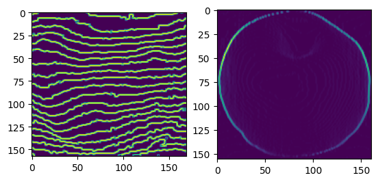</td>
        <td>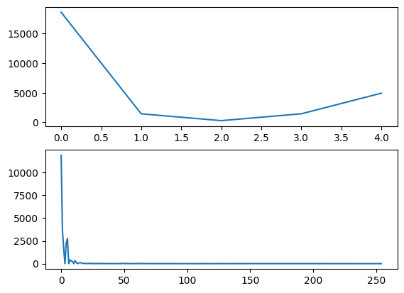</td>
    </tr>
</table>

After that, setting an gradient threshold for the detection would efficiently eliminate flatten photos, just like the result in the table.

### Task 2.3 PANDA Challenge
